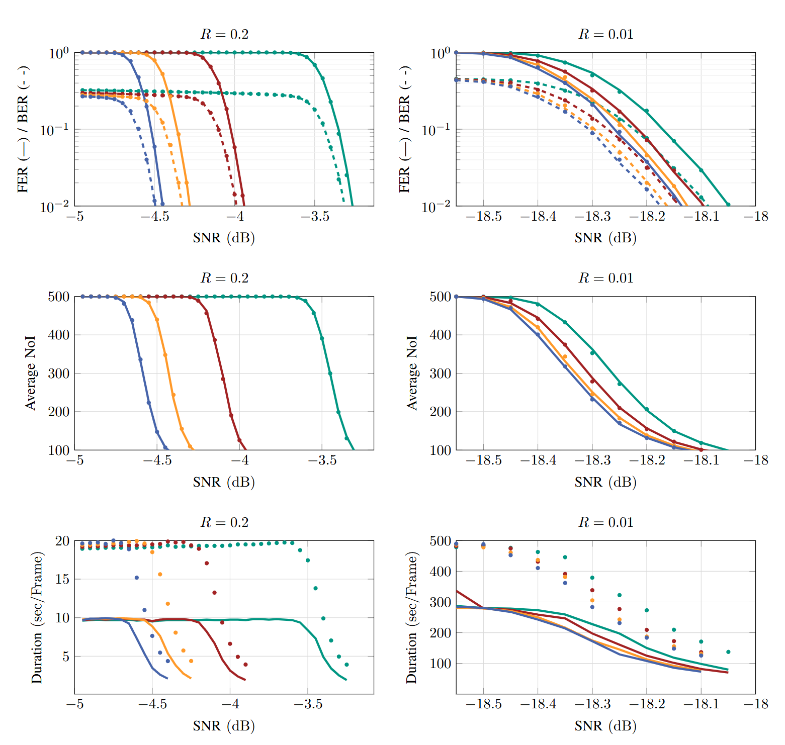

Example Use Cases
##############################

The Information Reconciliation Library for CV-QKD Systems provides two example use cases named `use_case`, demonstrating the library's usage. The test cases are located in the `tests` folders.

Both examples utilize the :func:`reconciliation::reconcile` in C++ and Python to directly perform the reconciliation of correlated observations between parties.

By modifying the `slow` and `fast` decoder options and :class:`MDR` dimension, users can compare the performance of the decoders. The results of the test cases are presented in :numref:`result` for the two extreme rate values supported by the library: rate 0.01 and rate 0.2.

    Results of test cases. FER, BER, and NoI represent frame error rate, bit error rate, and number of decoding iterations, respectively. The results are shown for :class:`MDR` dimensions of 8, 4, 2, and 1, from left to right. The `slow` decoder is denoted by points, while the `fast` decoder is represented by lines. Decoding durations are normalized to the number of parallel decoding operations and were obtained using an AMD EPYC :sup:`TM` 7713P 64-Core Processor.

