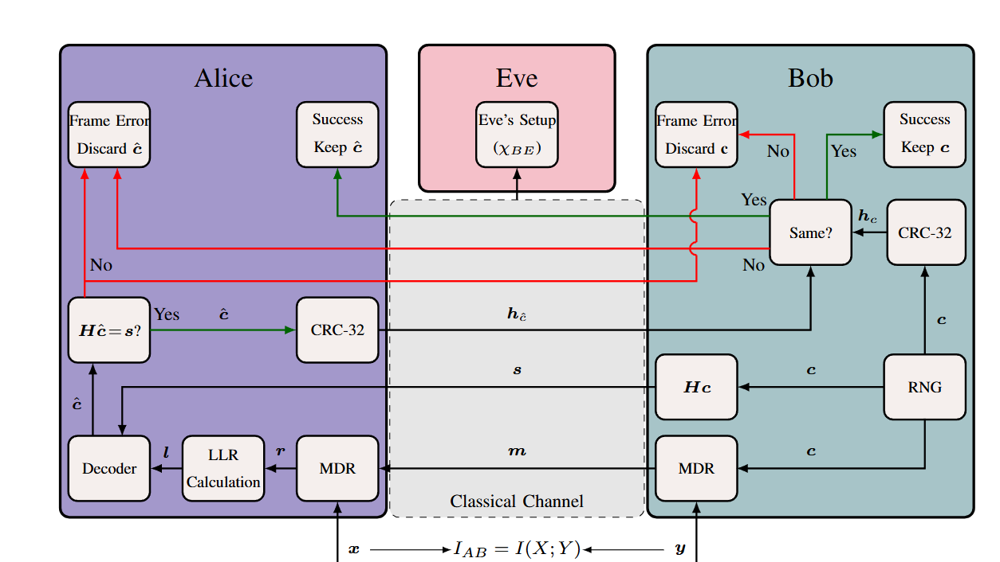

Reconciliation Namespace
##############################

This namespace provides classes and functions for information reconciliation in Continuous Variable Quantum Key Distribution (CV-QKD) systems. The reconciliation process involves comparing correlated observations between two parties and correcting errors.

The reconciliation process consists of the following steps:

1. **Random Number Generation:** The :ref:`QRNG class <QRNG_class>` is simulates the random number generation to be used as the raw key material. 
2. **Multi-dimensional Reconciliation:** The :ref:`MDR class <MDR_class>` performs multi-dimensional reconciliation.  
3. **Error Correction:** The :ref:`decoder class <decoder_class>` corrects the errors in key bits using the syndrome of the  algorithm to correct the errors in the key bits.
4. **Cyclic Redundancy Check(CRC):**  The :ref:`CRC class <CRC_class>` calculates the CRC of the key bits. Parties can verify key bit correctness by comparing CRCs.

The :ref:`reconciliation functions <reconciliation_functions>` are used as helpers in the process. 

Reverse Reconciliation
----------------------

The :func:`reconciliation::reconcile` function implements reverse reconciliation as in :numref:`RR` , allowing the user to perform the reconciliation of correlated observations between parties directly.

    The reverse reconciliation algorithm employing multi-dimensional reconciliation (MDR). RNG, LLR and **H** stand for random number generator, log-likelihood ratio and parity check matrix of the code respectively. **x** and **y** are the correlated observations of the parties.

Classes
----------------------

.. _decoder_class:

Decoder Class
============================

.. doxygenclass:: reconciliation::decoder
    :members:
    :protected-members:
    :private-members:    

.. _MDR_class:
MDR Class
============================

.. doxygenclass:: reconciliation::MDR
    :members:
    :protected-members:
    :private-members:    

.. _CRC_class:
CRC Class
============================

.. doxygenclass:: reconciliation::CRC
    :members:
    :protected-members:
    :private-members:    

.. _QRNG_class:
QRNG Class
============================

.. doxygenclass:: reconciliation::QRNG
    :members:
    :protected-members:
    :private-members:    

.. _reconciliation_functions:
Functions
---------------

.. doxygennamespace:: reconciliation

